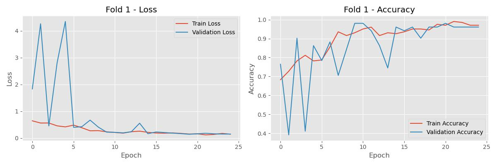

# Brain Tumor Detection using VGG16

A deep learning project for automated brain tumor detection from MRI images using transfer learning with VGG16 architecture and 5-fold cross-validation.

## 🎯 Project Overview

This project implements a robust brain tumor classification system that:
- Classifies MRI brain scans as tumor/no-tumor
- Uses transfer learning with pre-trained VGG16
- Employs 5-fold cross-validation for reliable evaluation
- Provides model explainability through Grad-CAM visualizations
- Achieves 90.52% average cross-validated accuracy

## 🏗️ Model Architecture

The model combines VGG16's powerful feature extraction with a custom classification head:

```
VGG16 (ImageNet pre-trained, frozen early layers)
├── Last 8 layers fine-tuned
├── AveragePooling2D (4x4)
├── Flatten
├── Dense (64 units, ReLU)
├── BatchNormalization
├── Dropout (0.4)
└── Dense (2 units, Softmax) → [No Tumor, Tumor]
```


## 📊 Performance Results

### Cross-Validation Results
- **Average Accuracy**: 90.52%
- **Validation Method**: 5-fold stratified cross-validation
- **Final Model Accuracy**: 100% (on test fold)

### Classification Metrics (Final Model)
```
              precision    recall  f1-score   support
          no       1.00      1.00      1.00        19
         yes       1.00      1.00      1.00        31
    accuracy                           1.00        50
   macro avg       1.00      1.00      1.00        50
weighted avg       1.00      1.00      1.00        50
```

### Model Performance Visualizations

<table>
<tr>
<td></td>
<td></td>
</tr>
<tr>
<td align="center">Confusion Matrix</td>
<td align="center">ROC Curve</td>
</tr>
<tr>
<td></td>
<td></td>
</tr>
<tr>
<td align="center">Precision-Recall Curve</td>
<td align="center">Training Progress (Fold 1)</td>
</tr>
</table>

## 🔍 Model Explainability

The project includes Grad-CAM (Gradient-weighted Class Activation Mapping) visualization to understand which brain regions influence the model's decisions:


This explainability feature is crucial for medical AI applications, helping healthcare professionals understand and trust the model's predictions.

## 🚀 Key Features

- **Transfer Learning**: Leverages VGG16 pre-trained on ImageNet
- **Cross-Validation**: 5-fold stratified CV for robust evaluation
- **Data Augmentation**: Rotation, zoom, and horizontal flip
- **Class Balancing**: Handles imbalanced dataset with weighted loss
- **Model Checkpointing**: Saves best model from each fold
- **Comprehensive Evaluation**: Multiple metrics and visualizations
- **Explainable AI**: Grad-CAM for prediction interpretability

## 🛠️ Technical Implementation

### Dependencies
```python
tensorflow >= 2.x
opencv-python
numpy
matplotlib
seaborn
scikit-learn
imutils
PIL
```

### Data Preprocessing
- Image resizing to 224×224 (VGG16 input size)
- VGG16-specific preprocessing (mean subtraction, scaling)
- Data augmentation for improved generalization

### Training Strategy
- **Fine-tuning**: Last 8 VGG16 layers unfrozen
- **Optimizer**: Adam with 1e-4 learning rate
- **Callbacks**: Early stopping, learning rate reduction, model checkpointing
- **Batch Size**: 8 (optimized for available memory)
- **Epochs**: Up to 25 per fold (with early stopping)

## 📁 Project Structure

```
brain-tumor-detection-vgg16/
├── brain_tumor_lets_see.py          # Main training script
├── brain_tumor_dataset/             # Training data
│   ├── yes/                         # Tumor images
│   └── no/                          # No tumor images
├── models/                          # Trained models
│   ├── best_model_fold1.keras
│   ├── best_model_fold2.keras
│   ├── best_model_fold3.keras
│   ├── best_model_fold4.keras
│   └── best_model_fold5.keras
├── results/                         # Evaluation results
│   ├── confusion_matrix_heatmap.jpg
│   ├── roc_curve.jpg
│   ├── precision_recall_curve.jpg
│   ├── grad_cam.jpg
│   ├── training_plot_fold*.jpg
│   ├── classification_report_fold*.txt
│   ├── final_classification_report.txt
│   └── vgg16_brain_model.png
└── README.md
```

## 🏃‍♂️ How to Run

1. **Clone the repository**:
   ```bash
   git clone https://github.com/[username]/brain-tumor-detection-vgg16.git
   cd brain-tumor-detection-vgg16
   ```

2. **Install dependencies**:
   ```bash
   pip install tensorflow opencv-python numpy matplotlib seaborn scikit-learn imutils pillow
   ```

3. **Run the training script**:
   ```bash
   python brain_tumor_lets_see.py
   ```

4. **Results**: Check the `results/` folder for all visualizations and metrics.

## 🔬 Medical AI Considerations

This project demonstrates several important aspects of medical AI:

- **Explainability**: Grad-CAM provides visual explanations
- **Robust Validation**: Cross-validation ensures reliable performance estimates
- **High Recall**: Important for medical screening (minimizing false negatives)
- **Confidence Scores**: Probability outputs for decision support

## 🚧 Future Improvements

- [ ] Ensemble methods combining multiple fold models
- [ ] Additional data augmentation techniques
- [ ] Integration with DICOM medical imaging standards
- [ ] Web interface for real-time predictions
- [ ] Extended dataset with more diverse cases
- [ ] Multi-class classification (tumor types)

## 📖 References

- VGG16: Simonyan, K., & Zisserman, A. (2014). Very deep convolutional networks for large-scale image recognition.
- Grad-CAM: Selvaraju, R. R., et al. (2017). Grad-cam: Visual explanations from deep networks via gradient-based localization.

## 📄 License

This project is open source and available under the [MIT License](LICENSE).

## 🤝 Contributing

Contributions, issues, and feature requests are welcome! Feel free to check the issues page.

---

**Note**: This model is for educational and research purposes. Any medical AI system requires extensive validation and regulatory approval before clinical use.